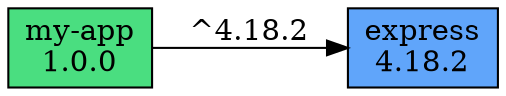
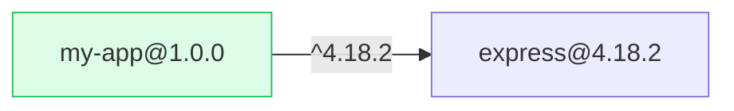

# dependency-graph

[](https://www.typescriptlang.org/)
[](https://opensource.org/licenses/MIT)
[](https://nodejs.org/)

A dependency graph analyzer for Node.js projects. Visualize dependency trees, detect circular dependencies, find unused packages, and identify version duplicates.

## Features

- **Dependency Tree** - Resolve and display the full dependency tree with depth tracking
- **Circular Detection** - Find circular dependencies using DFS cycle detection
- **Unused Detection** - Scan source files for imports and flag unused packages
- **Duplicate Detection** - Find packages with multiple resolved versions
- **Multiple Formats** - Output as tree, JSON, Graphviz DOT, or Mermaid flowchart

## Quick Start

```bash
npm install
npm run build

# Analyze current directory
npx depgraph analyze

# Analyze a specific project
npx depgraph analyze /path/to/project --format tree

# Full analysis with all checks
npx depgraph analyze --dev --circular --unused --duplicates
```

## Output Formats

### Tree (default)

```
my-app@1.0.0
├── express@4.18.2
│   ├── body-parser@1.20.1
│   │   └── bytes@3.1.2
│   ├── cookie@0.5.0
│   └── debug@2.6.9
│       └── ms@2.0.0
├── lodash@4.17.21
└── typescript@4.9.5 (dev)
```

### Graphviz DOT



### Mermaid Flowchart



### JSON

```json
{
  "name": "my-app",
  "version": "1.0.0",
  "stats": {
    "totalDependencies": 42,
    "directDependencies": 5,
    "transitiveDependencies": 37,
    "maxDepth": 7
  },
  "issues": {
    "circularDependencies": [],
    "unusedDependencies": [],
    "duplicateDependencies": []
  }
}
```

## CLI Options

| Option | Default | Description |
|--------|---------|-------------|
| `-d, --depth <n>` | `10` | Maximum depth to traverse |
| `--dev` | `false` | Include devDependencies |
| `-f, --format <type>` | `tree` | Output format: `tree`, `json`, `dot`, `mermaid` |
| `--circular` | `false` | Detect circular dependencies |
| `--unused` | `false` | Detect unused dependencies |
| `--duplicates` | `false` | Detect duplicate versions |

## How It Works

1. **Parse** - Reads `package.json` from the target directory
2. **Resolve** - Walks `node_modules` to resolve actual installed versions
3. **Graph** - Builds an adjacency list representation of the dependency graph
4. **Analyze** - Runs selected analyses (circular, unused, duplicates)
5. **Format** - Outputs the graph in the chosen format

### Circular Detection

Uses depth-first search with a recursion stack to detect back edges in the graph, which indicate cycles.

### Unused Detection

Scans all `.js`, `.ts`, `.jsx`, `.tsx` files for `require()` and `import` statements, then compares found package names against declared dependencies.

### Duplicate Detection

Tracks all resolved versions per package name. If a package appears with multiple versions in the tree, it's flagged as a duplicate.

## Project Structure

```
src/
  index.ts            - CLI entry point
  types.ts            - TypeScript interfaces
  analyzer.ts         - Core analysis engine
  graph.ts            - Graph data structure and algorithms
  formatters/
    tree.ts           - Indented tree output
    dot.ts            - Graphviz DOT format
    mermaid.ts        - Mermaid flowchart format
    json.ts           - JSON output
  utils/
    fs.ts             - File system utilities
```

## License

MIT

---

## Français

**dependency-graph** est un outil d'analyse de graphes de dépendances pour les projets Node.js. Il résout et affiche l'arbre complet des dépendances, détecte les dépendances circulaires via un algorithme DFS, repère les packages inutilisés en scannant les fichiers sources, et identifie les versions dupliquées — avec plusieurs formats de sortie (arbre, JSON, Graphviz DOT, Mermaid).

### Installation

```bash
npm install
npm run build
```

### Utilisation

```bash
# Analyser le répertoire courant
npx depgraph analyze

# Analyse complète avec toutes les vérifications
npx depgraph analyze --dev --circular --unused --duplicates --format tree
```

